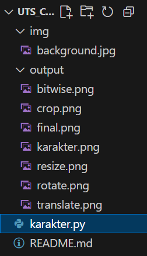

# 🐱 Tugas Karakter Kucing – Pengolahan Citra Digital

**Nama**    : M. Ulin Nuha Wahyu Pratama P.  
**NIM**     : 43050230020  
**Kelas**   : 5A - Teknologi Informasi  

---

## 😺 Karakter
Karakter yang dibuat adalah **kucing sederhana** dengan desain kartun menggunakan OpenCV.  
Ciri-ciri karakter:
- Kepala berbentuk lingkaran abu-abu  
- Dua telinga segitiga di atas kepala  
- Mata putih dengan pupil hitam  
- Hidung segitiga kecil berwarna oranye  
- Kumis di kedua sisi pipi  
- Mulut berbentuk “X” kecil di bawah hidung  

---

## 🔄 Transformasi dan Operasi
### 🧭 Transformasi:
- **Translasi** : Menggeser posisi kucing ke kanan bawah  
- **Rotasi** : Memutar karakter sebesar 30 derajat  
- **Resize** : Mengubah ukuran karakter menjadi lebih kecil  
- **Crop** : Memotong bagian tengah gambar untuk fokus pada kepala  

### ⚙ Operasi Bitwise:
- **Bitwise AND** : Mengambil irisan antara karakter dan background  
- **Bitwise OR** : Menggabungkan karakter dengan background untuk efek visual campuran  

---

## 📸 Screenshot

---

## 🖼 Hasil Akhir
### Karakter Asli  

### Rotasi  

### Crop  

### Bitwise  

### Final  

